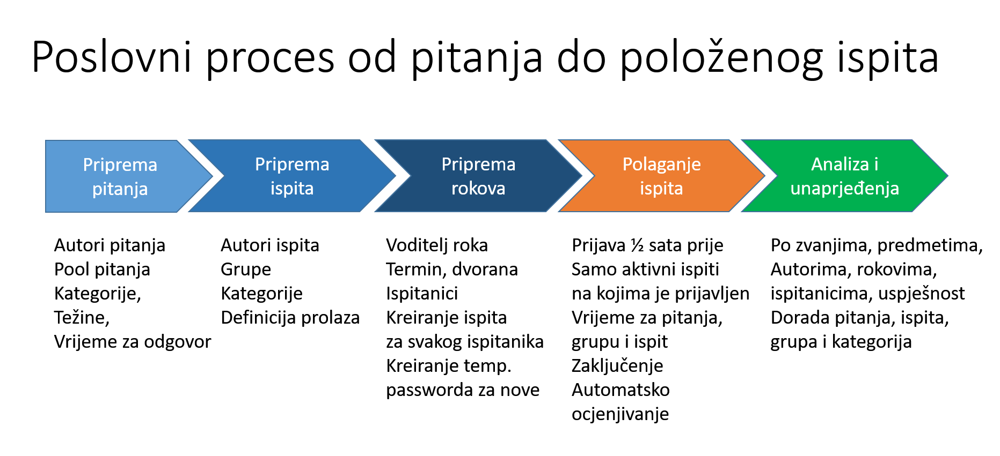

Dobro došli na Performa 365 Exams
==================================

eIspitni Sustav je platforma za polaganje pomorskih ispita.

Dio je to platforme za upravljanje znanjem i učenjem **Performa 365**. Ujedno, to je i osuvremenjeno on-line sučelje postojećeg sustava **ESPI** (Ekspertni Sustav za Polaganje Ispita).

Platforma se sastoji od dva dijela, tzv. **Back Office** dijela, u kojemu autori stvaraju i održavaju katalog pitanja i registar ispita za pojedina stručna zvanja i tzv. **Front Office** dijela, aplikacije za polaganje ispita (Player ispita). 

.. 

Sustav je pripremljen za dva osnovna načina rada:

-	Kao podrška ispitnim centrima, ovlaštenim i posebno opremljenim lokacijama gdje ispitanici dolaze položiti ispite i 
-	Kao podrška za on-line polaganje putem weba, koji će u budućnosti omogućiti ispitanicima da polažu ispite s bilo koje točke na svijetu (koja ima Internet vezu).

Sustav ima ugrađene najnovije organizacijske i tehnološke koncepte prema najvišim standardima te fleksibilno može podržati različite konfiguracije i strukture provjere znanja, stručnih ispita i certifikacija. 

Kroz osnovnu platformu Performa 365 moguće je više različitih ispita/certifikata povezati u jedinstveni program a polaznici mogu koristiti i druge module: učenje, organizaciju vlastitih kalendara učenja, ocjenjivanje edukacijskih sadržaja i timski rad.

Sigurnosno, prijave u sustav su zasnovane na svjetskom standardu za identifikaciju/autentikaciju korisnika (OpenID) što omogućuje naknadnu integraciju sa sustavom e-Građani (NIAS) i druge sustave.
Sve se aktivnosti u sustavu evidentiraju što omogućuje detaljnu analizu i naknadnu forenziku u slučaju sumnje na bilo kakve nedopuštene radnje. 

.. toctree::
   :maxdepth: 2
   :hidden:
   :caption: PRIJAVA U SUSTAV
   
   prijava_u_sustav/registracija
   prijava_u_sustav/prijava
   prijava_u_sustav/zaboravljena_lozinka
  

   
.. toctree::
   :maxdepth: 2
   :hidden:
   :caption: ULOGE U SUSTAVU

   uloge/index
   
.. toctree::
   :maxdepth: 2
   :hidden:
   :caption: POČETNI EKRAN

   opcenito/pocetni_ekran
   
   
.. toctree::
   :maxdepth: 2
   :hidden:
   :caption: GLAVNI IZBORNIK

   opcenito/glavni_izbornik
   

.. toctree::
   :maxdepth: 2
   :hidden:
   :caption: ADMINISTRACIJA PITANJA

   administracija_pitanja/prikaz_postojecih_pitanja
   administracija_pitanja/upis_novog_pitanja
   administracija_pitanja/izmjena_podataka_postojećeg_pitanja
   administracija_pitanja/aktiviranje_pitanja
   administracija_pitanja/deaktiviranje_pitanja
   administracija_pitanja/brisanje_pitanja

.. toctree::
   :maxdepth: 2
   :hidden:
   :caption: ADMINISTRACIJA ISPITA

   administracija_ispita
   
.. toctree::
   :maxdepth: 2
   :hidden:
   :caption: UPIS NOVOG ISPITA

   novi_ispit/osnovni_podaci_ispita
   novi_ispit/kategorije_ispita
   novi_ispit/rad_s_grupama_pitanja
   novi_ispit/grupe_pitanja
   novi_ispit/pitanja_u_grupi
   novi_ispit/uredjivanje_aktivacija_deaktivacija_brisanje_ispita
   
   
.. toctree::
   :maxdepth: 2
   :hidden:
   :caption: ADMINISTRACIJA ROKOVA

   administracija_rokova/prikaz_postojecih_rokova
   administracija_rokova/upis_novog_roka
   administracija_rokova/uredjivanje_aktivacija_deaktivacija_brisanje_roka
   administracija_rokova/ispis_liste_za_rok
   
.. toctree::
   :maxdepth: 2
   :hidden:
   :caption: MONITORING ROKA
   
   monitoring_roka
   

  
   
