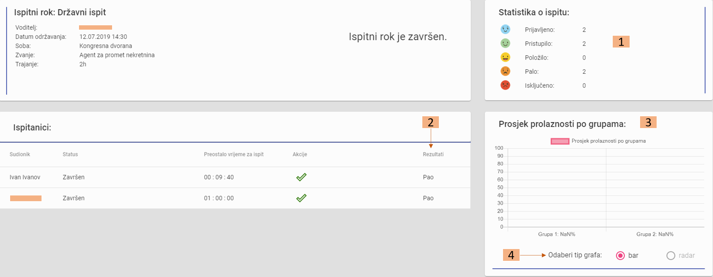

Nakon ispitnog roka
=======================

1. Prikaz statistike ispitanika na ispitu: prijavljeno, pristupilo, prošlo, palo, isključeno

2. Prikaz rezultata svakog ispitanika nakon zaključenja roka

3. Prikaz grafikona postotka prolaznosti po grupama pitanja na roku

4. Izbor tipa grafa: radar ili bar, za dvije i manje grupa obavezno bar

