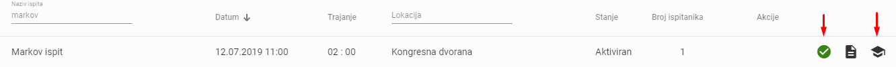

Prije ispitnog roka
=====================

Kada se kreira ispitni rok u polju *Akcije* prikazat će se iduće funkcije kako slijedi: 

- Uredi
- Obriši
- Aktiviraj
- Ispis

.. image:: rok_funkcije0.png
   :align: center

Izbor monitoringa aktiviranog roka
^^^^^^^^^^^^^^^^^^^^^^^^^^^^^^^^^^^^^^^^^^^^

Rok se može uređivati sve dok ga ne aktiviramo, a kada ga aktiviramo kvačica koja označava akciju *Aktiviraj* će pozeleniti i tada će se prikazati akcija *Monitoring*:

Prikaz podataka o roku na monitoring ekranu roka
^^^^^^^^^^^^^^^^^^^^^^^^^^^^^^^^^^^^^^^^^^^^^^^^^^^^^^

- Inicijalno će se otvoriti tri nova bloka informacija:

#. Osnovne informacije o roku; naziv roka, voditelj roka, datum održavanja roka, lokacija gdje se rok održava, zvanje za koje se polaže ispit i trajanje roka
#. Popis ispitanika roka - njihov status, preostalo vrijeme za ispit i polje *Akcije* 

- Sustav nudi sljedeće opcije: *Pauziraj sve*, *Nastavi sve*, *Završi rok*

3. U desnom kutu prikazana je *Statistika o ispitu* sa sljedećim stanjima:

- Prijavljeno:	
- Pristupilo:	
- Položilo:	
- Palo:	
- Isključeno:	

Prikaz popisa prijavljenih ispitanika
^^^^^^^^^^^^^^^^^^^^^^^^^^^^^^^^^^^^^^^^

U bloku *Ispitanici* prikazuje se popis prijavljenih kandidata za ispit, 

Potvrda prisutnosti ispitanika ili nije došao
^^^^^^^^^^^^^^^^^^^^^^^^^^^^^^^^^^^^^^^^^^^^^^^^^^

Status ispitanika: 

- npr. *Čekanje na potvrdu* - čeka se da voditelj roka potvrdi da je ispitanik prisutan; *Ispitanik potvrđen* - voditelj roka je potvrdio da je ispitanik prisutan klikom na kvačicu i kvačica u polju *Akcije* pozeleni

- Ako ispitanik nije došao, voditelj roka klikom na opciju X potvrđuje da kandidat nije prisutan. U polju akcije se pojavljuje oznaka kružne strelice, a *Status* se izmijeni u *Ispitanik se nije pojavio*

.. note:: Ispitanik može početi s rješavanjem ispita isključivo uz potvrdu prisutnosti voditelja roka, tada će se na njegovom ekranu prikazati opcija *Kreni* i ispitnaik može početi s ispitom.

Ipak je došao
^^^^^^^^^^^^^^

- *kružna strelica* daje mogućnost izmjenu statusa ispitanika u slučaju da se ispitanik ipak pojavi
- klikom na kružnu strelicu otvara se prozor s pitanjem *Želite li potvrditi da je kandidat prisutan?*, klikom na *Potvrdi* u polju *Akcije* ponovo će se prikazati oznaka "kvačice" i "X"
- U tom slučaju je potrebno klikon na kvačicu potvrditi konačnu prisutnost i kvačica mora "pozeleniti" 

Ipak nije došao
^^^^^^^^^^^^^^^^^

- U slučaju da je kandidat potvrđen greško, klikom na zelenu kvačicu u polju *Akcije* otvorit će se prozor s pitanjem *Jeste li sigurni da želite odjaviti kandidata?*
- klikom na potvrdi mijenja se ispitanikov status u "čekanje na potvrdu"
