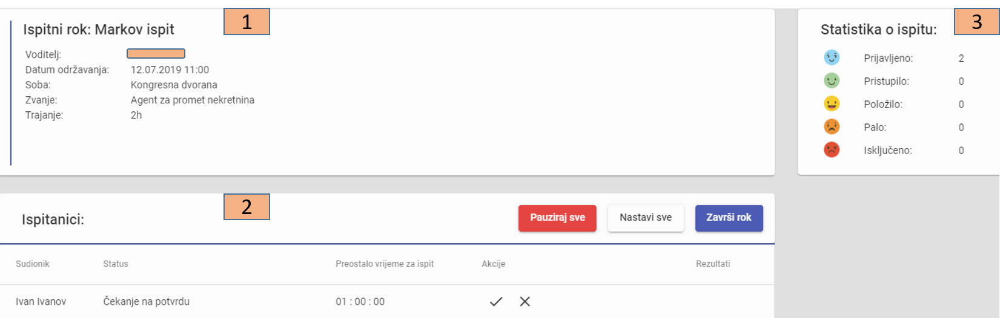

Uvod u monitoring roka
====================

- U glavnom izborniku odaberemo naredbu Rokovi gdje će se otvoriti popis upisanih rokova
- U navigacijskoj traci u polju Akcije odaberemo naredbu *Monitoring*

.. note:: Oznaka *Monitoring* će se pojaviti samo u slučaju da je ispit aktiviran. Jednom kada se ispit aktivira, naredba *Monitoring* biti će dostupna za izmjene.

- Inicijalno će se otvoriti tri nova bloka informacija:

#. Osnovne informacije o roku
#. Popis ispitanika roka 
#. U desnom kutu prikazana je *Statistika o ispitu* 

Po zaključenju ispitnog roka će se pojaviti četvrti blok sa grafičkim prikazom rezultata.
